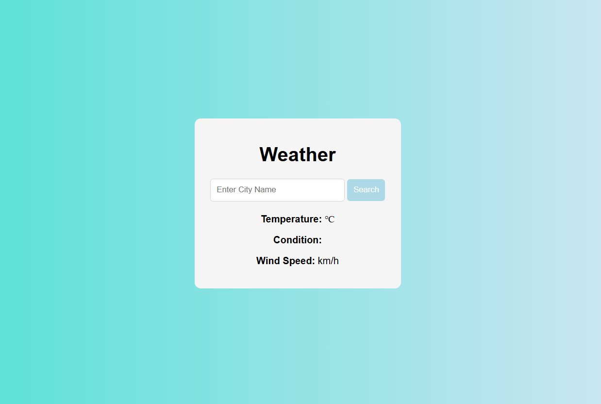

# 🌤️ Weather App

A clean, minimal weather dashboard that delivers real-time conditions for any city worldwide. Powered by free, open-source APIs with no API key required, it displays temperature, wind speed, and a descriptive weather condition alongside a matching weather icon.

## ✨ Features

- **City Search**: Look up current weather for any city globally by typing a name and pressing Search or hitting Enter.
- **Geocoding Integration**: Automatically resolves a city name into precise latitude/longitude coordinates before fetching weather data, ensuring accurate location matching.
- **Real-Time Weather Data**: Fetches live conditions including temperature (°C), wind speed (km/h), and a WMO weather interpretation code mapped to a human-readable condition.
- **Dynamic Weather Icons**: Displays a contextual icon (sun, cloud, rain, snow, fog, thunderstorm) that updates automatically based on the current weather code returned by the API.
- **Keyboard Support**: Supports Enter key submission on the search input for a faster, frictionless user experience.
- **Graceful Image Handling**: Hides the weather image element when no city has been searched yet, keeping the initial UI clean.
- **Subtle Button Interactions**: The search button lifts slightly on hover and snaps back on click using CSS `translateY` transitions for tactile feedback.

## 🛠️ Tech Stack

- **HTML5**: Semantic markup for the search input, weather display fields, and image container.
- **CSS3**:
  - Linear gradient background (`turquoise` → `lavender`) for a calm, atmospheric feel.
  - Flexbox centering for a perfectly positioned card layout.
  - CSS transitions on the search button for smooth hover and active state animations.
  - Attribute selector (`img[src=""]`) to conditionally hide the image before a search is made.
- **Vanilla JavaScript (ES6+)**:
  - `async/await` for clean, readable API call chains.
  - A `weatherCodeMap` object that maps all WMO weather interpretation codes (0–99) to a condition label and corresponding icon asset.
  - DOM manipulation via `getElementById` to update the UI dynamically after each search.
- **Open-Meteo Geocoding API**: Converts city name input into geographic coordinates (`latitude`, `longitude`, `country`).
- **Open-Meteo Forecast API**: Returns `current_weather` data (temperature, wind speed, weather code) using the resolved coordinates.

## 🚀 Live Demo

👉 [View Live Demo](https://jimmy-ai2.github.io/weather/)

## 📖 How to Use

1. **Add Icon Assets**: Place your weather icon images (`sun.png`, `cloudy.png`, `overcast.png`, `fog.png`, `rain.png`, `snow.png`, `thunderstorm.png`) inside an `assets/` folder in the project root.
2. **Open the App**: Launch `index.html` in any modern web browser — no build step or server required.
3. **Search for a City**: Type a city name into the input field and click **Search** or press **Enter**.
4. **View Results**: The app displays the city name (with country), current temperature, weather condition, wind speed, and a matching weather icon.

## 📸 Screenshots

| Default State                           | Search Results                           |
| --------------------------------------- | ---------------------------------------- |
|  |  |

## 🔮 Future Improvements

- **Error Handling**: Add user-facing feedback for invalid city names or failed API requests (e.g., a "City not found" message).
- **Loading State**: Show a spinner or skeleton UI while API requests are in flight to improve perceived performance.
- **5-Day Forecast**: Extend the Open-Meteo API call to include `daily` forecast data and render a multi-day outlook below the current conditions.
- **Unit Toggle**: Add a switch to toggle between Celsius and Fahrenheit, converting temperature values client-side.
- **Geolocation**: Add a "Use My Location" button that fetches weather for the user's current coordinates via the browser's `navigator.geolocation` API.

## 👤 About

This project was built as a practical exploration of working with third-party REST APIs in plain JavaScript. It demonstrates a complete async data-fetching pipeline — from geocoding a user's text input to rendering live weather results — without any frameworks or dependencies.
